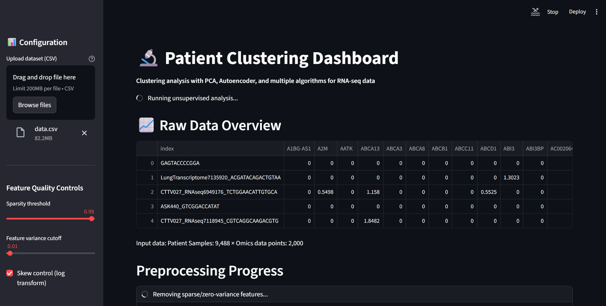
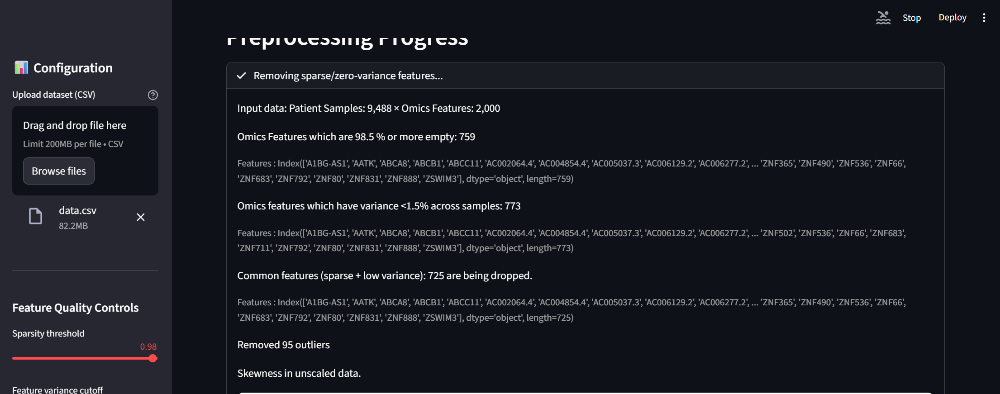
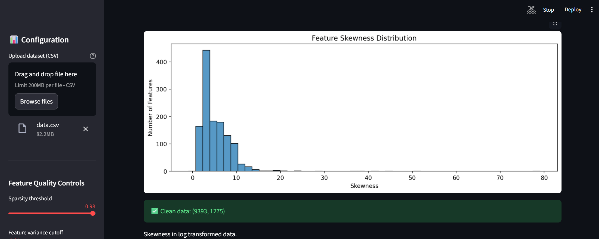
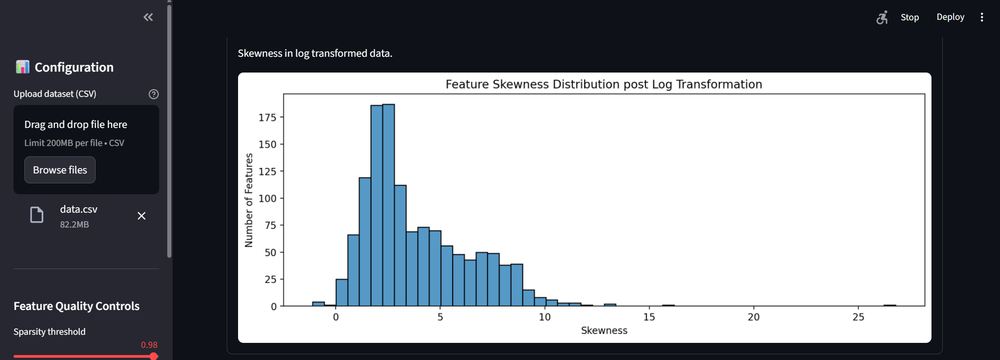
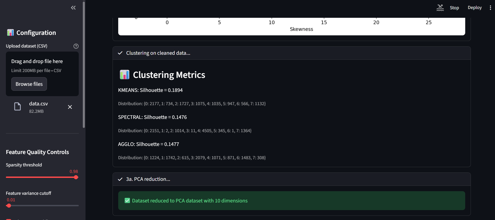
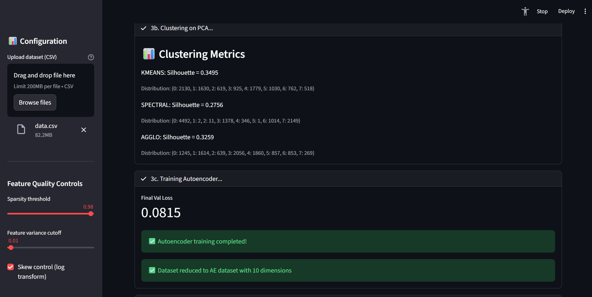
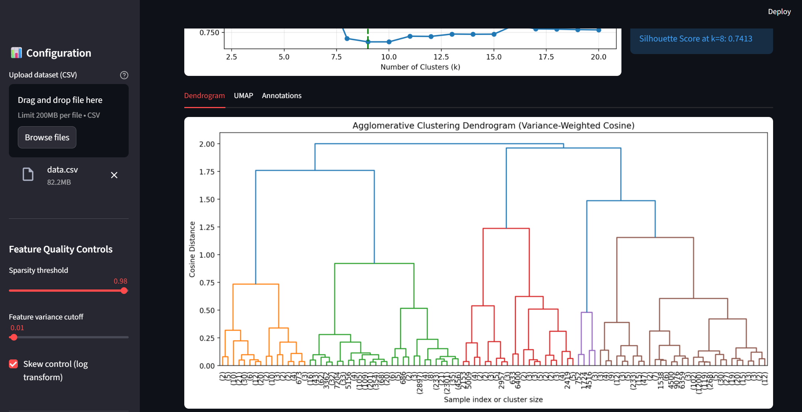

# Patient Stratification
Patient Clustering & Stratification Pipeline - Unsupervised analysis for high-dimensional omics data
---


# Introduction
This app demonstration an unsupervised learning pipeline for patient clustering and stratification. The app incorporates: 
- Data cleaning for sparse omics data and near constant (low variable) features.    
- Standardization (Robust Scaler) and skewness normalization (Log Normal).  
- Outlier removal
- Silhouette score comparison of clustering of raw patient data with PCA / Autoencoder reduction across KMeans, Spectral, and Agglomerative clustering.   
  - Apply variance-weighted cosine distance for RNA-seq co-regulation patters to improve silhoutte score.    
  - Upcoming versions to include more user controls and customization over data normalization and stardization techniques 

## :ledger: Index

- [About](#beginner-about)
- [Usage](#zap-usage)
  - [Installation](#electric_plug-installation)
  - [Demo](#Demo)
- [Development](#wrench-development)
  - [Pre-Requisites](#notebook-pre-requisites)
  - [Developmen Environment](#nut_and_bolt-development-environment)
  - [File Structure](#file_folder-file-structure)
  - [Build](#hammer-build)  
  - [Deployment](#rocket-deployment)  
  - [Roadmap](#roadmap-roadmap)
- [Community](#cherry_blossom-community)
  - [Contribution](#fire-contribution)
- [FAQ](#question-faq)
- [Gallery](#camera-gallery)
- [Credit/Acknowledgment](#star2-creditacknowledgment)
- [License](#lock-license)

##  :beginner: About
Comprehensive unsupervised clustering pipeline for patient stratification from high-dimensional gene expression data. Example RNA-Seq data. User can upload any high-dimensional omics data.

Note:
- Rows : 1st row : Index. 2nd onwards : Different patient samples
- Columns : 1st column : Patient Index. 2nd onwards : Omic feature
 
 Handles sparsity (example set at 98.5% zero features), skewness, outliers, and compares PCA/Autoencoder dimensionality reduction with KMeans, Spectral, and Agglomerative clustering. 
 
 Key innovation: Variance-weighted cosine distance for RNA-seq co-regulation patterns (12.5% → 74.1% silhouette score improvement):

Current Features (v1.0)

| App               | Description                       | Status  | Test Silhoutte Score |
| ----------------- | --------------------------------- | ------- |-------------------|
| 🧹 Preprocessing  | Sparse/low-var filtering, log-transform, RobustScaler, IsolationForest | ✅ Live  | N/A |
| 📉 Dimensionality Reduction | PCA (10D), Autoencoder (10D latent)| ✅ Live  | N/A |
| 🤖 Clustering| KMeans, Spectral (RBF), Agglomerative (Ward)| ✅ Live  | 3.36 (KMeans PCA) |
| 🔬 Advanced | Variance-weighted cosine Agglomerative (find optimal k) | ✅ Live  | 0.741 | 
| 📊 Visualization | UMAP comparison, knee plots, dendrograms | ✅ Live  | N/A | 
| 🖥️ Streamlit App | Full pipeline + interactive controls | ✅ Live  | N/A |


**Result Summary:** PCA reduction yielded best clustering (0.36 silhouette), Agglomerative excelled on non-spherical data, variance-weighted cosine achieved state-of-the-art separation for gene expression.


## :zap: Usage

###  :electric_plug: Installation

- Steps on how to install this project, to use it.

```
$ git clone https://github.com/PoweredwithAI/PatientStratification.git
$ cd PatientStratification
$ poetry install
$ poetry shell

```

###  :zap: Demo

Live App: streamlit run streamlit/app.py
- Upload CSV (samples × genes)
- Auto preprocessing + 5 clustering methods
- Interactive UMAP/dendrogram exploration
- Download cluster annotations

Sample Workflow:

```
$ # Full pipeline
$ streamlit run streamlit/app.py

$ # CLI usage (future)
$ python src/clustering.py --data data/data.csv

```

**Live Demo:** [https://patient-stratification.streamlit.app/](https://patient-stratification.streamlit.app/)

##  :wrench: Development
Would love collaborators

### :notebook: Pre-Requisites
- Python 3.10+ | Poetry 1.8+ | Git

###  :nut_and_bolt: Development Environment

- Setting up the working environment.

```
$ # Full pipeline
$ streamlit run streamlit/app.py

$ # CLI usage (future)
$ python src/clustering.py --data data/raw/patients_raw.csv

```

###  :file_folder: File Structure

```
PatientStratification/
├── pyproject.toml          # Dependencies
├── poetry.lock
├── README.md
├── streamlit/
│   ├── app.py             # 🔬 Main dashboard
│   └── config.yaml        # Pipeline params 
├── src/                   # Core library
│   ├── __init__.py        # Exports 
│   ├── config.py          # Config dataclass 
│   ├── preprocessing.py   # Sparse filtering, scaling 
│   ├── dimensionality_reduction.py  # PCA, Autoencoder 
│   ├── clustering.py      # KMeans/Spectral/Agglo + cosine 
│   └── visualization.py   # UMAP, dendrograms 
├── data/                  # Sample data
│   ├── raw/
│   └── processed/
├── artifacts/             # Outputs
│   ├── clustering/        # CSV results
│   └── figures/           # UMAP, knee_plot.png
├── notebooks/             # Exploration
└── tests/                 # Unit tests

```

###  :hammer: Build

```
$ poetry build      # Wheel + sdist
$ poetry publish    # PyPI (future)

```
### :roadmap: Roadmap

v1.0 (Live)    🧬 CLI interface, batch processing
v2.0 (H1 2026) 📊 scikit-learn Pipeline integration, HDBSCAN
v3.0 (H2 2026) 🧪 Multi-omics (scRNA + proteomics), biomarker discovery

## :cherry_blossom: Community

Contributions welcome! Add new clustering methods or visualizations.

 ###  :fire: Contribution

 Your contributions are always welcome and appreciated. 

 1. **Report a bug** <br>
 If you think you have encountered a bug, and I should know about it, feel free to report it and I will take care of it.

 2. **Request a feature** <br>
 You can also request for a feature, and if it will viable, it will be picked for development.  

 3. **Create a pull request** <br>
 It can't get better then this, your pull request will be appreciated by the community. You can get started by picking up any open issues from and make a pull request.

 > If you are new to open-source, make sure to check read more about it [here](https://www.digitalocean.com/community/tutorial_series/an-introduction-to-open-source) and learn more about creating a pull request [here](https://www.digitalocean.com/community/tutorials/how-to-create-a-pull-request-on-github).

## :question: FAQ

Q: What data format?

A: CSV (rows=samples, cols=genes/features), handles ~10K×2K
​

Q: Production ready?

A: Research-grade (v1.0). Add tests for production.

Q: Why cosine distance?

A: Captures RNA co-regulation patterns vs Euclidean magnitude


##  :camera: Gallery

### Patient Clustering Pipeline (v1.1)


*Clean interface ready for mining*

















### Apps developed but not integrated (v1.0)

🔬 Full Drug Discovery Platform (Standalone Demo)

[](https://www.youtube.com/watch?v=qcCzyao6460) 

*7:24 walkthrough: Hit generation → t-SNE → Retrosynthesis → Boltz-2 docking*

**Key Visualizations:**

- UMAP Grid: Raw(↑) vs PCA(↓) vs AE (9 panels)
- Knee Plot: Silhouette vs k (elbow k=8)
- Dendrogram: Complete linkage, cosine distance
- Skewness: Pre/post log1p histograms
​
Live Demo: streamlit run streamlit/app.py → Upload → "Run Full Pipeline"

## :star2: Credit/Acknowledgment

- Prof. Hamim Zafar - EE965 (Unsupervised Learning) instructor - https://www.iitk.ac.in/hamim-zafar
​- scikit-learn: KMeans, Spectral, Agglomerative, IsolationForest
- umap-learn: Dimensionality visualization
- Streamlit: Interactive dashboard

##  :lock: License
MIT - Free for research, commercial.
